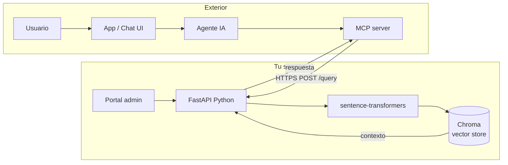
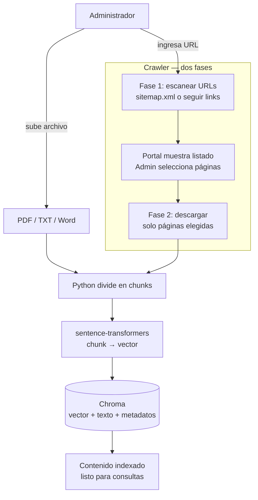
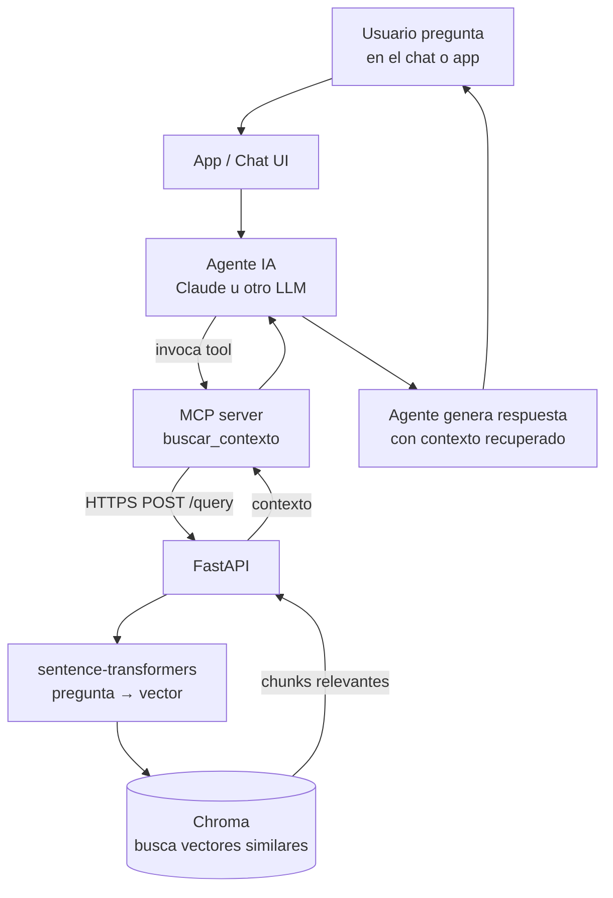

# Arquitectura RAG — Guía de proyecto

Sistema RAG (Retrieval-Augmented Generation) self-hosted con Python, Chroma, FastAPI y MCP.

---

## Stack tecnológico

| Componente | Tecnología | Rol |
|---|---|---|
| Embeddings | sentence-transformers | Convierte texto en vectores |
| Vector store | Chroma | Almacena y consulta vectores |
| API | FastAPI (Python) | Expone endpoints de ingesta y consulta |
| Crawler | BeautifulSoup / Scrapy | Escanea y descarga páginas web |
| Agente IA | Claude u otro LLM | Genera respuestas con contexto |
| Puente agente | MCP server | Expone herramienta `buscar_contexto` |
| Infraestructura | Servidor propio + HTTPS + DNS | Todo self-hosted, costo $0 |

---

## Arquitectura general



---

## Flujo de ingesta

El proceso de ingesta es **offline** — se ejecuta cuando el administrador agrega contenido nuevo.



---

## Flujo de conversación

El proceso de conversación ocurre en **tiempo real** por cada pregunta del usuario.



---

## Crawler — detalle de dos fases

### Fase 1: escaneo de URLs

1. Intentar `dominio.com/sitemap.xml` primero
2. Si no existe, rastrear links del HTML recursivamente
3. Respetar `robots.txt`
4. Retornar listado de URLs al portal

### Fase 2: descarga selectiva

1. Admin selecciona URLs de interés en el portal
2. Crawler descarga solo esas páginas
3. Extrae texto limpio (sin menús, footers, banners)
4. Entrega el texto al pipeline de chunks

---

## Endpoints FastAPI

| Método | Endpoint | Descripción |
|---|---|---|
| `POST` | `/ingest/file` | Recibe archivo y lo indexa |
| `POST` | `/ingest/crawl/scan` | Fase 1: retorna listado de URLs |
| `POST` | `/ingest/crawl/download` | Fase 2: descarga URLs seleccionadas |
| `GET` | `/docs` | Lista documentos indexados |
| `DELETE` | `/docs/{id}` | Elimina documento del índice |
| `GET` | `/stats` | Estadísticas del índice |
| `POST` | `/query` | Consulta semántica — usado por MCP |

---

## Portal de administración

Interfaz web para gestionar el índice sin tocar código.

**Funciones:**
- Subir documentos (PDF, TXT, Word)
- Ingresar URL para crawl con selección de páginas
- Ver listado de documentos indexados
- Eliminar documentos del índice
- Ver estadísticas (cantidad de vectores, documentos)
- Probar queries manualmente antes de conectar el agente

---

## Consideraciones importantes

### Crawler
- Definir profundidad máxima de rastreo
- Limpiar HTML: eliminar nav, footer, scripts, ads
- Controlar duplicados por URL
- Sitios con JavaScript requieren Playwright o Selenium

### Chroma
- Guardar metadatos: URL de origen, fecha de indexación, nombre de archivo
- Permite citar la fuente en las respuestas del agente

### sentence-transformers
- Modelo recomendado inicial: `all-MiniLM-L6-v2` (~90MB, corre en CPU)
- El mismo modelo debe usarse en ingesta y en consulta

### Seguridad
- Portal protegido con autenticación (JWT o básica)
- Endpoint `/query` expuesto por HTTPS para el MCP
- Chroma nunca expuesto al exterior, solo accesible internamente

---

## Estructura de carpetas sugerida

```
rag-project/
├── ingesta/
│   ├── chunker.py          # Divide documentos en fragmentos
│   ├── embedder.py         # Genera embeddings con sentence-transformers
│   ├── crawler.py          # Escanea y descarga páginas web
│   └── indexer.py          # Almacena en Chroma
├── api/
│   ├── main.py             # FastAPI app principal
│   ├── routes/
│   │   ├── ingest.py       # Endpoints de ingesta
│   │   └── query.py        # Endpoint de consulta
├── mcp/
│   └── server.py           # MCP server con tool buscar_contexto
├── portal/
│   └── index.html          # Portal de administración
└── requirements.txt
```

---

*Documento generado como guía de referencia para el desarrollo del sistema RAG self-hosted.*
