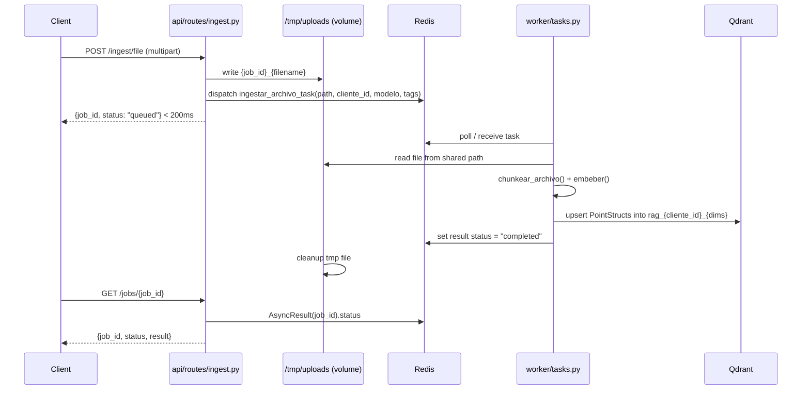
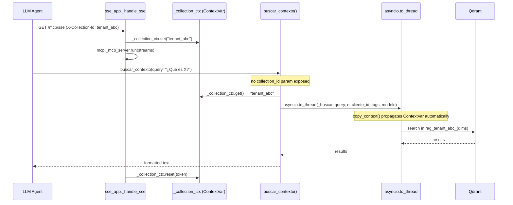

# Design: RAG Enterprise-Scale Refactor

## Technical Approach

Replace Chroma with Qdrant using a module-level singleton that mirrors the current `_cliente`/`_colecciones` pattern in `indexer.py`. Wrap ingestion in Celery tasks with a shared Docker volume for file hand-off. Inject tenant scope at the SSE session boundary via `contextvars.ContextVar`, making it unreachable by LLM tool arguments.

---

## Architecture Decisions

### Decision: Qdrant singleton vs. connection pool

| Option | Tradeoff | Decision |
|--------|----------|----------|
| Module-level singleton `QdrantClient` | Matches current Chroma pattern; HTTP transport is stateless; no pool needed | **Chosen** |
| Connection pool | Adds complexity; unnecessary for single-node, concurrency=1 worker | Rejected |
| Per-request client | Cold connection on every call; unacceptable latency | Rejected |

**Rationale**: Current `_get_cliente()` pattern works and is well-understood. Qdrant's HTTP client is thread-safe by design.

### Decision: Collection naming `rag_{cliente_id}_{dims}`

| Option | Tradeoff | Decision |
|--------|----------|----------|
| `rag_{cliente_id}_{dims}` | Hard isolation; one collection = one tenant+model | **Chosen** |
| Single collection + metadata filter | Current Chroma approach; cross-tenant leak risk remains | Rejected |
| `rag_{cliente_id}` only | Breaks multi-model support; dims mismatch on upsert | Rejected |

**Rationale**: Hard boundary is the SaaS prerequisite. Collection-per-tenant makes it impossible to accidentally cross-query.

### Decision: File hand-off via shared Docker volume (not base64/message body)

| Option | Tradeoff | Decision |
|--------|----------|----------|
| Shared volume path `/tmp/uploads/{job_id}_{filename}` | Zero serialization overhead; works on single node | **Chosen** |
| Embed file bytes in Celery message | Redis memory pressure for large PDFs; Celery not designed for binary payloads | Rejected |
| S3/MinIO staging | Cloud dependency or extra service; out of scope | Rejected |

**Rationale**: Single-node constraint makes shared volumes trivially reliable. No extra services needed.

### Decision: `contextvars.ContextVar` for MCP tenant scoping (not middleware param nor tool arg)

| Option | Tradeoff | Decision |
|--------|----------|----------|
| `ContextVar` set in SSE handler | LLM cannot read or override it; propagates through `asyncio.to_thread` automatically in Python 3.12 | **Chosen** |
| Tool argument `proyecto` (current) | LLM-controlled; forgeable; incompatible with SaaS security model | Rejected |
| ASGI middleware that patches request.state | `request.state` not accessible inside FastMCP tool functions | Rejected |

**Rationale**: `contextvars` is the idiomatic Python 3.12 mechanism. `copy_context()` propagation means `asyncio.to_thread` workers see the same context without manual plumbing.

### Decision: Celery result backend for job status (not a DB table)

| Option | Tradeoff | Decision |
|--------|----------|----------|
| Celery AsyncResult via Redis backend | Zero extra schema; TTL-based cleanup; status available immediately | **Chosen** |
| Postgres/SQLite jobs table | Requires schema migration; overkill for status polling | Rejected |
| SSE push from worker | Persistent connection management complexity; not required by spec | Rejected |

---

## Data Flow

### Async Ingestion Flow



### MCP Query Flow



---

## File Changes

| File | Action | Description |
|------|--------|-------------|
| `ingesta/indexer.py` | Replace | Chroma → Qdrant; same public interface (`indexar`, `buscar`, `listar_documentos`, `listar_proyectos`, `eliminar_documento`, `actualizar_tags_proyecto`, `purgar`, `stats`) |
| `mcp_local/sse_app.py` | Modify | Add `_collection_ctx` ContextVar; extract `X-Collection-Id` in `_handle_sse`; remove `proyecto` param from `buscar_contexto` |
| `api/routes/ingest.py` | Modify | `ingestar_archivo` and `crawl_download` write file to `/tmp/uploads/`, dispatch Celery task, return `{job_id, status}` |
| `api/routes/jobs.py` | Create | `GET /jobs/{job_id}` reads `AsyncResult(job_id)` from Celery |
| `api/main.py` | Modify | `include_router(jobs.router)` with `validar_token_o_service_key` dependency |
| `worker/__init__.py` | Create | Empty package marker |
| `worker/celery_app.py` | Create | `Celery("localrag", broker=REDIS_URL, backend=REDIS_URL)` |
| `worker/tasks.py` | Create | `ingestar_archivo_task`, `ingestar_urls_task` — shared-task decorated functions |
| `docker-compose.yml` | Create | 4-service topology (see Interfaces section) |
| `requirements.txt` | Modify | Remove `chromadb`; add `qdrant-client`, `celery[redis]`, `redis` |

---

## Interfaces / Contracts

### `ingesta/indexer.py` — public interface preserved

```python
# UNCHANGED signatures — upstream callers require zero edits
def indexar(chunks: list[dict], modelo: str = MODEL_DEFAULT) -> int: ...
def buscar(query: str, n_resultados: int = 5, proyecto: str | None = None,
           tags: list[str] | None = None, modelo: str = MODEL_DEFAULT) -> list[dict]: ...
def listar_documentos(proyecto: str | None = None) -> list[dict]: ...
def listar_proyectos() -> list[str]: ...
def eliminar_documento(fuente: str) -> int: ...
def purgar(proyecto: str | None = None) -> int: ...
def stats() -> dict: ...
```

Qdrant-specific internals (not public):

```python
# collection name: rag_{cliente_id}_{dims}
# cliente_id comes from env QDRANT_TENANT (default "default") or call arg
# PointStruct(id=uuid4_str, vector=embedding, payload={texto, fuente, tipo, tags: list})
# Filter: models.Filter(must=[models.FieldCondition(key="tags", match=models.MatchAny(any=tags))])
```

### `worker/celery_app.py`

```python
REDIS_URL = os.getenv("REDIS_URL", "redis://redis:6379/0")
app = Celery("localrag", broker=REDIS_URL, backend=REDIS_URL)
app.conf.task_serializer = "json"
app.conf.result_expires = 86400  # 24h TTL
```

### `api/routes/jobs.py`

```python
# GET /jobs/{job_id}
# Response: {job_id, status: pending|started|success|failure, result?: {...}}
```

### `docker-compose.yml` topology

```yaml
services:
  api:
    build: .
    ports: ["8000:8000"]
    volumes: ["uploads:/tmp/uploads"]
    environment: [QDRANT_HOST=qdrant, REDIS_URL=redis://redis:6379/0]
    depends_on: [qdrant, redis]

  worker:
    build: .
    command: celery -A worker.celery_app worker --concurrency=1 --loglevel=info
    volumes: ["uploads:/tmp/uploads"]
    environment: [QDRANT_HOST=qdrant, REDIS_URL=redis://redis:6379/0]
    depends_on: [qdrant, redis]

  qdrant:
    image: qdrant/qdrant:latest
    ports: ["6333:6333"]
    volumes: ["qdrant_data:/qdrant/storage"]
    healthcheck:
      test: ["CMD", "curl", "-f", "http://localhost:6333/healthz"]
      interval: 10s
      retries: 5

  redis:
    image: redis:7-alpine
    ports: ["6379:6379"]
    volumes: ["redis_data:/data"]
    healthcheck:
      test: ["CMD", "redis-cli", "ping"]
      interval: 10s
      retries: 5

volumes:
  uploads:
  qdrant_data:
  redis_data:
```

### `mcp_local/sse_app.py` — changed signatures

```python
# Before:
async def buscar_contexto(query: str, proyecto: str = "", n_resultados: int = 5) -> str

# After:
async def buscar_contexto(query: str, n_resultados: int = 5) -> str
# collection_id read from _collection_ctx.get() — not exposed to LLM
```

---

## Testing Strategy

No automated test runner. Manual smoke-test checklist per capability:

| Layer | What to Test | Approach |
|-------|-------------|----------|
| Qdrant isolation | Tenant A docs not visible to Tenant B | `curl` two ingest+query sequences with different `X-Collection-Id` |
| Async ingestion | Job reaches `success` status | `POST /ingest/file` → poll `GET /jobs/{job_id}` until `success` |
| MCP scoping | LLM cannot override collection | Call `buscar_contexto` from Claude with forged `proyecto` arg — must be ignored |
| Docker Compose | `docker compose up` → all 4 services healthy | Check `/healthz` Qdrant + `redis-cli ping` + `GET /` API |

---

## Migration / Rollout

1. `docker compose down` (stops API + current Chroma)
2. Delete or rename `requirements.txt` entry: `chromadb` → `qdrant-client celery[redis] redis`
3. `docker compose up --build` (Qdrant + Redis start fresh; no data migration)
4. Re-ingest all documents via existing `/ingest/file` and `/ingest/crawl/download` endpoints
5. Chroma volume (`./data/chroma/`) kept intact for 48h rollback window

Rollback path: git revert `ingesta/indexer.py`; remove `worker/`; revert `docker-compose.yml`; `docker compose up --build`.

---

## Open Questions

- [ ] `proyecto` field in chunk metadata becomes `cliente_id` inside Qdrant payload — confirm upstream callers (`query.py`, `docs.py`) reference metadata by field name or by collection boundary (collection boundary preferred, field names can remain `proyecto` for backward compat)
- [ ] `actualizar_tags_proyecto` does a full fetch+rewrite; Qdrant supports `set_payload` on filtered points — consider `overwrite_payload` for efficiency (non-blocking concern, can be addressed post-migration)
